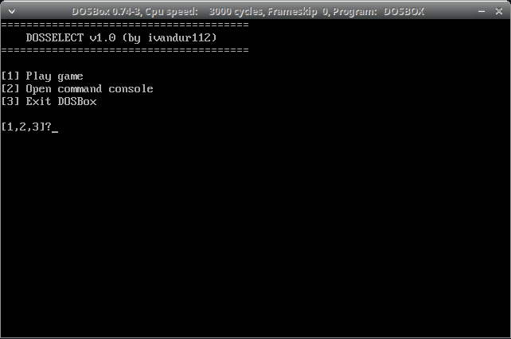

# DOSSelect

This is a small project I made for self-learning purposes. I wanted to understand how a `.config` file works in DOSBox and how the `[autoexec]` section behaves.

At the beginning, my goal was to run **SRB2Xmas 0.96** on Ubuntu 22.04. The simple solution was just mounting the game folder inside `[autoexec]` and launching it manually.

But that felt repetitive, so I decided to build something better: a simple DOS-style launcher menu that runs automatically when DOSBox starts.

This project works directly from the **`[autoexec]` section of the DOSBox configuration file**, meaning no manual startup commands are needed.



---

## 1. Requirements to use it

> · If you are on Windows:
>   - Windows 7 / 8 / 8.1 / 10 / 11 (32 or 64 bits)

> · If you are on Linux:
>   - Any distro that supports DOSBox (SDL-based systems)

> · If you are on Mac:
>   - macOS X or newer

> · You also need:
>   - DOSBox 0.7+ installed (recommended: 0.74.3)

---

## 2. What this project does

DOSSelect runs automatically when DOSBox starts.

It replaces the usual manual workflow (`mount`, `cd`, `start`) with a simple menu:

- **1 → Play game**
  - Mounts the game directory and launches the game

- **2 → Open command console**
  - Opens a DOS shell inside the mounted environment

- **3 → Exit DOSBox**
  - Closes the emulator

---

## 3. How it works

Everything runs inside the `[autoexec]` section of `dosbox.conf`.

Instead of launching a separate `.BAT` file, the menu system is executed directly at startup.

It uses basic DOS batch commands like:
- `choice`
- `if errorlevel`
- `mount`
- `goto`

This makes DOSBox behave like a simple boot menu system.

---

## 4. Installation

1. Install DOSBox
2. Open your `dosbox.conf` file
3. Edit the `[autoexec]` section like this in ```example.config```.
4. Start DOSBox and DOSSelect would appear automatically.

## 5. License
I know there's already a file resuming these BUT I would put it anyway...

**MIT License** - This means you are free to use, modify and share it. BUT with the condition of **CREDITING ME**.

BYE!!! - Yours truly, ivandur112


